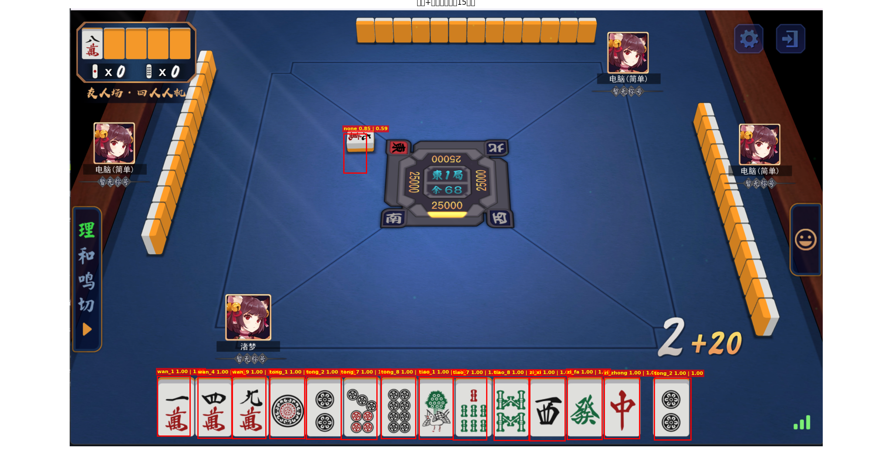
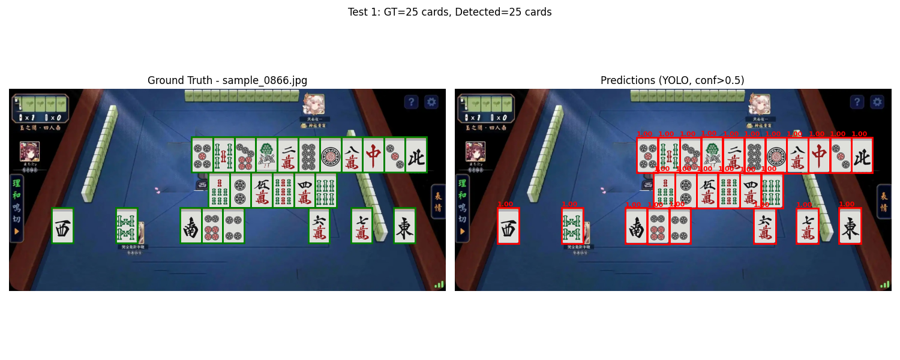
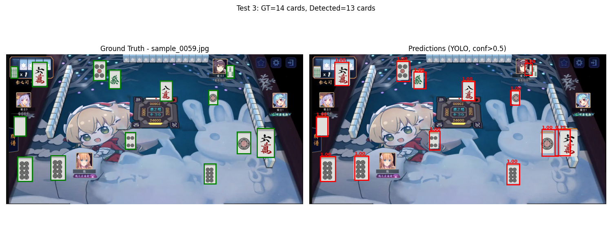
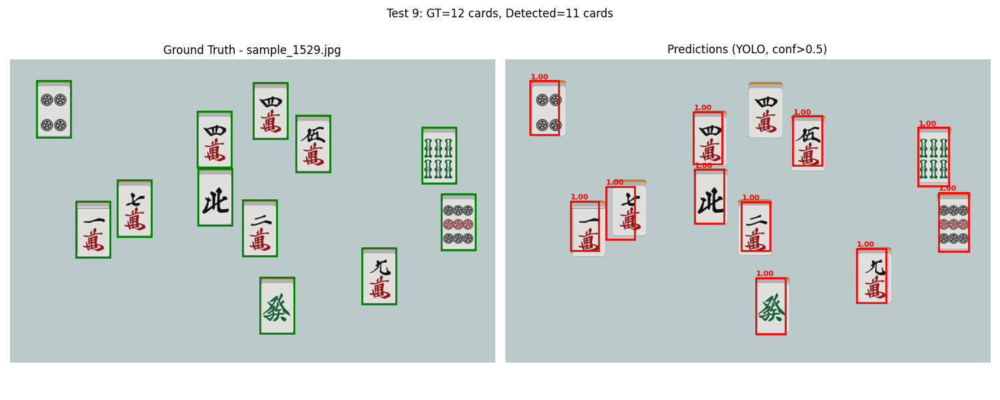

# 麻将检测+分类 Mahjong-Detector & Classifier

本项目是一个基于深度学习的麻将牌检测与分类工具，支持自动生成训练数据、模型训练、推理和可视化。
使用视觉方案获取某不愿透露姓名的雀姓在线麻将游戏的手牌。牌堆识别还在练。

## 麻将的训练样本
亮点是用代码生成图片作为训练样本，不用手动标注数据。
在detect_data_generator文件夹中：`generate_classifier_samples.py` `generate_classifier_samples_v2.py`、`generate_classifier_samples_v3.py`都是用于生成数据的脚本。v3最接近游戏中的样子，建议使用。训练后准确率还是很高的。
1. v3

2. v2

3. v1


## 功能简介

- 自动生成麻将牌检测与分类训练样本
- YOLO风格麻将检测模型训练与测试
- ResNet麻将分类模型训练与测试
- 一键检测图片中的麻将牌并分类
- 丰富的数据增强与样本混合方式

## 依赖环境

- Python
- PyTorch
- torchvision
- numpy
- Pillow
- matplotlib

安装依赖：
```bash
pip install torch torchvision numpy pillow matplotlib
```

## 目录结构

- `detect_data_generator/`：数据生成脚本
- `MahjongDetector_train.py`：检测模型训练
- `MahjongDetector_test.py`：检测模型测试与可视化
- `MahjongClassifier_train.py`：分类模型训练
- `MahjongClassifier_test.py`：分类模型测试与可视化
- `mahjong_detect_tool.py`：检测+分类一体化推理工具
- `templates/`：麻将牌图案模板
- `background/`：背景图片
- `generate_classifier_samples.py` `generate_classifier_samples_v2.py`、`generate_classifier_samples_v3.py`：生成自动生成训练样本
- `generate_classifier_samples.py`：生成分类训练样本

## 快速开始

1. **生成检测训练样本**
   ```bash
   python detect_data_generator/generate_detector_samples_v3.py
   ```

2. **训练检测模型**
   ```bash
   python MahjongDetector_train.py ./training_samples_v3
   ```

3. **测试检测模型**
   ```bash
   python MahjongDetector_test.py ./training_samples_v3
   ```

4. **生成分类训练样本**
   ```bash
   python detect_data_generator/generate_classifier_samples.py
   ```

5. **训练分类模型**
   ```bash
   python MahjongClassifier_train.py
   ```

6. **测试分类模型**
   ```bash
   python MahjongClassifier_test.py ./classifier_train
   ```

7. **推理与可视化**
   ```bash
   python mahjong_detect_tool.py
   ```

## 许可证

MIT License
